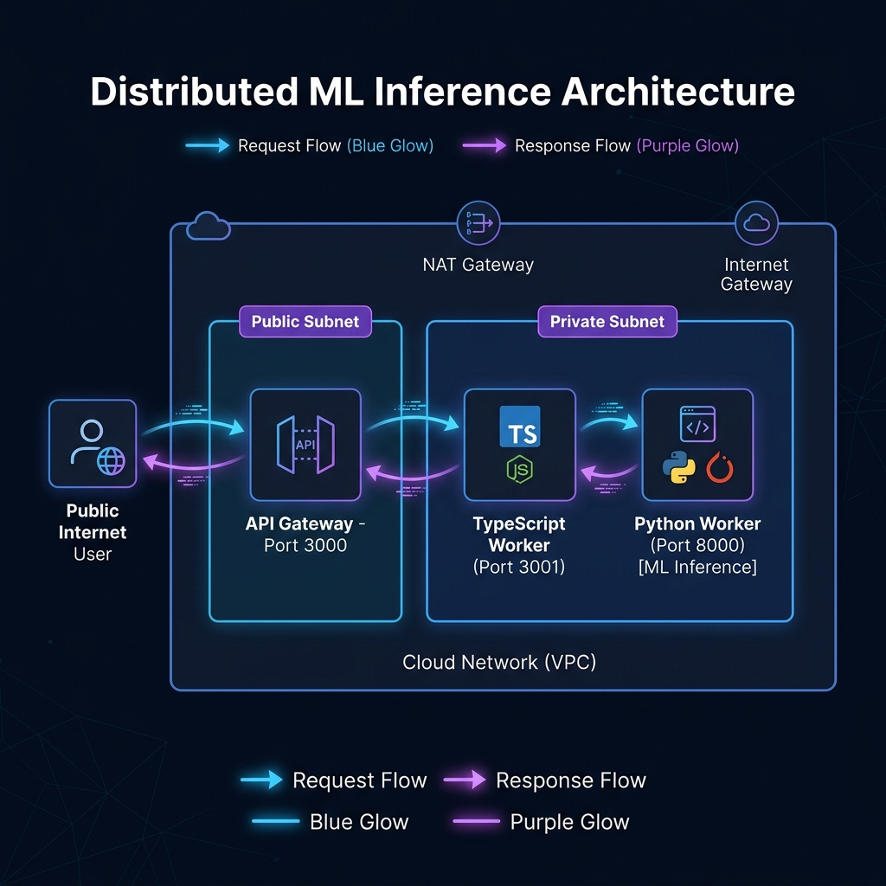

# Distributed Inference Monitor

A distributed Small Language Model (SLM) inference mesh. It runs across three VMs connected over HTTP RPC inside a private network subnet, fronted by a public API Gateway. 

This repository contains both **Google Cloud Platform (GCP)** and **Amazon Web Services (AWS)** Infrastructure-as-Code, deployment scripts (systemd units), and the application source code.

---

## Architecture & RPC Flow



### Request Flow
1. **User** sends a `POST /infer` request to the public **API Gateway** (port 3000).
2. **API Gateway** validates the input and forwards the RPC payload to the private **TypeScript Worker** (port 3001).
3. **TypeScript Worker** processes/enriches the payload and calls the private **Python Worker** (port 8000).
4. **Python Worker** runs the SLM stub and returns inference metadata (tokens used, latency, etc.).
5. The response travels back up the chain, getting enriched at each layer, before returning to the **User**.

---

## Repository Structure

```
inference-monitor/
├── infra/
│   ├── terraform/          # GCP Infrastructure-as-Code (VPC, VMs, Firewall, NAT)
│   └── aws-terraform/      # AWS Infrastructure-as-Code (VPC, VMs, Security Groups)
├── workers/
│   ├── python-worker/      # Python inference service (Port 8000)
│   │   └── deploy/         # systemd unit & setup script
│   └── typescript-worker/  # TypeScript preprocessing/chaining service (Port 3001)
│       └── deploy/         # systemd unit & setup script
└── api-gateway/            # Express.js public gateway service (Port 3000)
    └── deploy/             # systemd unit & setup script
```

---

## JSON API Specifications & Verification

Verify the system by calling these gateway endpoints:

### 1. Run Inference (`POST /infer`)
**Sample Request:**
```bash
curl -X POST http://<GATEWAY_PUBLIC_IP>:3000/infer \
  -H "Content-Type: application/json" \
  -d '{
    "prompt": "What is machine learning?",
    "max_tokens": 100,
    "temperature": 0.7
  }'
```

**Sample Response (200 OK):**
```json
{
  "result": "[python-worker] Processed: \"What is machine learning?\" | max_tokens=100 temperature=0.70",
  "tokens_used": 18,
  "latency_ms": 245,
  "worker_chain": ["typescript", "python"]
}
```

### 2. Check Health (`GET /health`)
Verify that both backend workers are reachable from the gateway.
```bash
curl http://<GATEWAY_PUBLIC_IP>:3000/health
```
```json
{
  "status": "ok",
  "workers": {
    "python": "reachable",
    "typescript": "reachable"
  },
  "uptime_seconds": 3600
}
```

### 3. Check Metrics (`GET /metrics`)
```bash
curl http://<GATEWAY_PUBLIC_IP>:3000/metrics
```
```json
{
  "total_requests": 42,
  "average_latency_ms": 198,
  "error_count": 1,
  "uptime_seconds": 7200,
  "last_update_ts": 1716384000000
}
```

---

## Redeploy from Scratch (Fresh AWS Account)

1. **Configure Credentials**: Ensure your AWS CLI is configured (`aws configure`).
2. **Create SSH Key**: Create a key pair in the AWS console named `inference-key` and download the `.pem` file.
3. **Deploy with Terraform**:
   ```bash
   cd infra/aws-terraform
   cp terraform.tfvars.example terraform.tfvars
   # Edit terraform.tfvars to match your aws_region and set ssh_key_name = "inference-key"
   terraform init
   terraform apply -auto-approve
   ```

*Note: Startup scripts will configure and run Node/Python, register the services as systemd units, and start them automatically. Wait ~3 minutes after `terraform apply` finishes for all installations to complete.*

---

## Production Hardening Writeup

Before launching this stack in production, we would implement the following security and architecture enhancements:

* **Eliminate Public SSH Access**: Restrict port 22 access entirely. Use AWS Systems Manager Session Manager (SSM) to log into VMs securely without exposing SSH ports to the public internet.
* **API Security & Gateway Protection**: Add an Application Load Balancer (ALB) fronted by AWS WAF (Web Application Firewall) to handle DDoS protection and SSL/TLS termination (HTTPS on port 443). Add authentication (e.g., JWT, OAuth2, or API Keys) on the `/infer` endpoint to block unauthorized users.
* **Autoscaling & High Availability**: Deploy the gateway and workers inside AWS Auto Scaling Groups (ASGs) across multiple availability zones. Implement health probes to automatically replace degraded VMs.
* **Secrets Management**: Remove hardcoded URLs and ports from configuration files. Store configurations and downstream URLs securely in AWS Systems Manager Parameter Store or Secrets Manager.

---

## Scaling to a 100x Larger Model

Scaling to a 100x larger model (e.g., a 7B to 70B parameter model) requires re-architecting the compute, storage, and processing pipelines:

* **GPU Compute VM Infrastructure**: CPU inference is too slow for large models. We must provision GPU-accelerated instances (such as AWS `g5` or `p4` instances with NVIDIA GPUs).
* **Storage and Caching Weights**: Model weights (15GB–140GB+) cannot be baked into VM startup code or fetched from Git. We would store the weights in Amazon S3, cache them on a fast EBS GP3 volume attached to the VM, and load them using memory-mapped formats (e.g., SafeTensors).
* **High-Throughput Inference Engines**: Swap the standard Python HTTP server for a dedicated inference server like **vLLM**, **TGI (Text Generation Inference)**, or **NVIDIA Triton**. These engines optimize GPU memory allocation (PagedAttention) and support continuous batching.
* **Distributed RPC & Message Queuing**: For large models, generation latency increases from milliseconds to seconds. The synchronous gateway-to-worker pattern should be replaced with an asynchronous queue (e.g., Amazon SQS or Kafka). The client submits an inference request, receives a `202 Accepted` receipt, and retrieves the generated tokens via WebSockets, Server-Sent Events (SSE), or polling.
